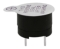
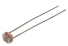
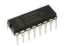
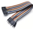

# Introduction and list of kits

**Keyestudio ESP32 Learning Kit Ultimate Edition**

**1.Introduction：**

Do you want to learn about programming?

As long as you're passionate about science and dare to explore new things, this kit is surely the best choice for you. The Keyestudio ESP32 Learning Kit Ultimate Edition mainly contains some common electronic components/sensors/modules, a ESP32 mainboard and bread wires are also included.

As many as 117 project tutorials are provided, which contain detailed wiring diagrams, components knowledge, and fascinating project code. Each project is produced using Thonny for Windows, Arduino IDE for Windows, and Arduino IDE for Raspberry Pi.  It's easy to get started.

You can create numerous fascinating DIY experiments with one controller(ESP32), various of sensors/modules and electronics. These courses can give you a deeper understanding of programming methods, logic, electronic circuits and the Linux operating system (Raspberry Pi).

2.  **Kit：**

When you received the kit , the first thing you see is a beautiful packaged box. Each accessory was safely and orderly packed in a small bag. Let's check them first:

|                                           |                                                |                                          |                                           |                                           |
| ----------------------------------------- | ---------------------------------------------- | ---------------------------------------- | ----------------------------------------- | ----------------------------------------- |
|   |        |  |   |   |
| ESP32 Mainboard*1                         | Blue LED*10                                    | Red LED*10                               | Yellow LED*10                             | Green LED*10                              |
|  |       |                  |                   |                  |
| RGB*1                                     | 220ΩResistor*10                                | 10KΩResistor*10                          | 1KΩResistor*10                            | 10KΩ Potentiometer*1                      |
|                  |                       |                 |                  |                  |
| Active Buzzer*1                           | Passive Buzzer*1                               | Button*4                                 | Tilt Switch*1                             | Photoresistor*2                           |
|                  |                       |                 |                  |                  |
| Flame Sensor*1                            | Yellow Cap*4                                   | IC 74HC595N *1                           | 1-Digit Tube Display*1                    | 4-Digit Tube Display*1                    |
|                  |                       |                 |                  |  |
| 8*8 Dot Matrix Display *1                 | Temperature and Humidity Sensor*1              | LCD_128X32_DOT *1                        | IR Receiver*1                             | IR Remote Controller*1                    |
|                  |                       |                 |                  |                  |
| Servo*1                                   | 4*4 Membrane Keypad*1                          | 130 DC Motor*1                           | Stepper Motor Driver Board*1              | Stepper Motor*1                           |
|                  |                       |                 |  |                  |
| Joystick Module*1                         | Sound Sensor*1                                 | PIR Motion Sensor*1                      | RFID Module*1                             | Ultrasonic Sensor*1                       |
|                  |                       |                 |                  |                  |
| LM35 Temperature Sensor*1                 | 5V Relay Module*1                              | 10K Thermistor*1                         | ABS Key Chain*1                           | White Card*1                              |
|                  |                       |                 |                  |                  |
| Breadboard*1                              | USB Cable*1                                    | Resistance Card*1                        | Jumper Wire*30                            | M-F Dupont Wire40                         |
|                  |                       |                 |                  |                  |
| Battery Holder*1                          | Keyestudio bread board special power module *1 | Fan*1                                    | NPN transistor(S8050)*1                   | PNP transistor(S8550)*1                   |

**3.Project directory：**

|             |                            |
| ----------- | -------------------------- |
| Project 01: | Hello World                |
| Project 02: | Turn on LED                |
| Project 03: | LED Flashing               |
| Project 04: | Breathing Led              |
| Project 05: | Traffic Lights             |
| Project 06: | RGB LED                    |
| Project 07: | Flowing Water Light        |
| Project 08: | 1-Digit Digital Tube       |
| Project 09: | 4-Digit Digital Tube       |
| Project 10: | 8×8 Dot-matrix Display     |
| Project 11: | 74HC595N Control 8 LEDs    |
| Project 12: | Active Buzzer              |
| Project 13: | Passive Buzzer             |
| Project 14: | Mini Table Lamp            |
| Project 15: | Tilt and LED               |
| Project 16: | Burglar Alarm              |
| Project 17: | I2C 128×32 LCD             |
| Project 18: | Small Fan                  |
| Project 19: | Servo Sweep                |
| Project 20: | Stepping Motor             |
| Project 21: | Relay                      |
| Project 22: | Dimming Light              |
| Project 23: | Flame Alarm                |
| Project 24: | Night Lamp                 |
| Project 25: | Human Induction Lamp       |
| Project 26: | Sound Control Fan          |
| Project 27: | Temperature Measurement    |
| Project 28: | Rocker control Light       |
| Project 29: | Temperature Humidity Meter |
| Project 30: | Ultrasonic Ranger          |
| Project 31: | Temperature Instrument     |
| Project 32: | RFID                       |
| Project 33: | Keypad Door                |
| Project 34: | IR Control Sound and LED   |
| Project 35: | Bluetooth                  |
| Project 36: | WiFi Station Mode          |
| Project 37: | WiFi AP Mode               |
| Project 38: | WiFi Station+AP Mode       |
| Project 39: | WiFi Test                  |
| Project 40: | WiFi Smart Home            |

